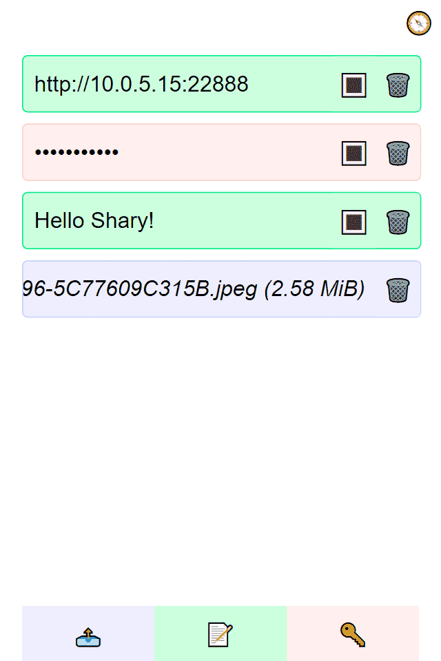

# Shary

Shary is an HTTP server for quickly sharing files and text snippets in LAN.

## Usage

Run the `shary` executable. It will start an HTTP server, listening on `0.0.0.0:22888` by default.

Visit the web page via any device on the LAN.

* Click on "📄" at the bottom to share a file
* Click on "🔤" at the bottom to share some text.
* Click on "🔑" at the bottom to share a password.

The shared entries are shown in the middle of the page.

* Click on any item to copy or download it.
* Click on "🗑️" to delete the entry.

The server address can be found by clicking "🧭" on the top-right.

## Caveat

Shary is designed for quick and easy sharing with no consideration of security. And thus, Shary should only be used in a **trusted local network**. Malicious users accessing Shary can:

* Copy any shared password, and reveal as clear text.
* Download any shared file.
* Delete any shared item.
* Upload files with no size limit, thus potentially filling up server's hard disk.

Unlike Apple AirDrop or Microsoft Near Share, Shary relies on WiFi or local Ethernet. Two devices must connect to the same network to use Shary.

## License

[MIT](./LICENSE).
